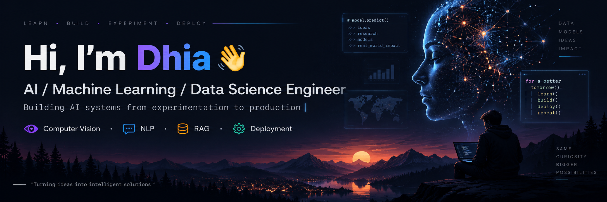

  

# Hi, I'm Dhia Eddine Jedidi 👋

### AI / Machine Learning / Data Science Engineer

Building AI systems that go beyond notebooks — from experimentation and benchmarking to APIs, Docker deployment and production inference.

📍 Bizerte, Tunisia · Open to relocation

---

## 👨‍💻 About Me

I'm an AI/ML Engineer focused on turning machine learning models into usable, production-ready systems.

My experience covers:

- 🧠 Machine Learning & Deep Learning
- 👁️ Computer Vision
- 💬 NLP, Transformers & LLM applications
- 🔎 RAG, Graph-RAG & AI Agents
- ⚙️ Model optimisation and inference
- 🚀 Flask / FastAPI model deployment
- 🐳 Docker-based AI systems
- 📊 Data Engineering, BI & Forecasting

I enjoy working on problems where AI has to perform reliably outside the notebook.

---

## 🚀 What I've Worked On

### 🏭 OctoNorm — Industrial Visual Quality Control

AI-powered visual inspection system developed during my AI Engineering internship at **Octomiro**.

- Replaced approximately **1 hour of manual production stoppage** with **6–10 second inspections per tray**
- Benchmarked **10 AI pipelines**
- Worked with **3,300+ annotated instances**
- Achieved **0.967 AUROC**
- Deployed using **Flask + React + Docker**
- Production inference running on a **V100S GPU server**
- Built a retraining workflow accessible from the operator dashboard

---

### 📄 OCR + BERT Document Classification

Developed during my internship at **El Fouladh**.

- OCR + BERT document classification pipeline
- Achieved **96% accuracy**
- Exposed through a **Flask REST API**
- Automated document routing
- Reduced processing time by approximately **90%**

---

### 🎯 YOLOv8 Object Detection

Freelance AI project focused on model optimisation.

- Fine-tuned YOLOv8
- Improved mAP from **0.72 → 0.91**
- Exported and optimised inference using ONNX
- Reduced inference latency by **45%**

---

## 🔬 Featured Projects

### 📊 BI & Analytics Platform

`PostgreSQL` · `Talend` · `Python` · `Power BI` · `Flask` · `Angular`

- Data warehouse for supply-chain analytics
- Automated ETL pipelines
- ML/DL demand forecasting
- Interactive Power BI dashboards

---

### 🎥 Video Emotion Recognition

`PyTorch` · `OpenCV` · `3D CNN` · `Autoencoder` · `LSTM` · `Attention`

Built a multi-stage deep learning pipeline for video emotion recognition using the CREMA-D dataset, exposed through a Flask API with a Streamlit webcam interface.

---

### 🌐 Twitter Influence Graph Analysis

`BERTweet` · `GNN` · `Graph-RAG` · `PyTorch Geometric`

- Sentiment analysis on **1.6M tweets**
- **92% sentiment classification accuracy**
- Influence graph containing 150K nodes and 500K edges
- Applied GNNs and Graph-RAG for influencer detection

---

## 🧠 AI & Machine Learning Stack

### Machine Learning

### Deep Learning

### Generative AI

### Deployment & MLOps

### Data & BI

---

## 📈 GitHub Stats

---

## 🔥 GitHub Streak

---

## 🎓 Education

**Engineering Degree in Computer Science — Data Science Track**  
ESPRIT, Tunis · Expected 2026

**BSc Applied Mathematics — Data Science**  
FST, University of Tunis El Manar · 2020–2023

---

## 📜 Certifications

- NVIDIA — Fundamentals of Deep Learning
- NVIDIA — AI for Predictive Maintenance
- NVIDIA — Transformer-Based NLP Applications
- IBM — Deep Learning with PyTorch
- AWS — Cloud Foundations
- The Hashgraph Association — Hashgraph Developer Course

---

## 🌍 Languages

🇹🇳 Arabic — Native  
🇫🇷 French — B2  
🇬🇧 English — B2

---

### 🤝 Let's Connect

I'm interested in opportunities in **AI Engineering, Machine Learning, Computer Vision, NLP, Generative AI and Data Science**.

[LinkedIn](https://linkedin.com/in/dhia-eddine-jdidi) ·
[GitHub](https://github.com/Dhaw208)

